  

  
  
  
  
  
  
  

## `$ ls ~/work`

| repo | what it is |
| --- | --- |
| [volnixos](https://github.com/lowcache/volnixos) | nix configuration with a volatile tmpfs root — the impermanence paradigm, committed to |
| [volinit](https://github.com/lowcache/volinit) | shell-init sys-info fetch in nim, with custom ascii artwork |
| [mcp-box](https://github.com/lowcache/mcp-box) | highly isolated linux containers built for MCP servers — secure agent tool execution |
| [noctalia-claude-plugin](https://github.com/lowcache/noctalia-claude-plugin) | claude code plugin for the noctalia desktop shell |
| [memd](https://github.com/lowcache/memd) | project memory for coding agents |

## `$ gh stats`

  

