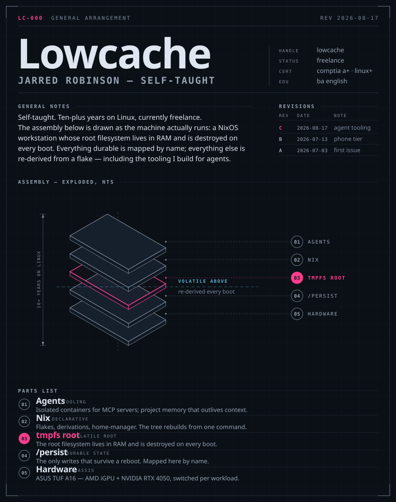
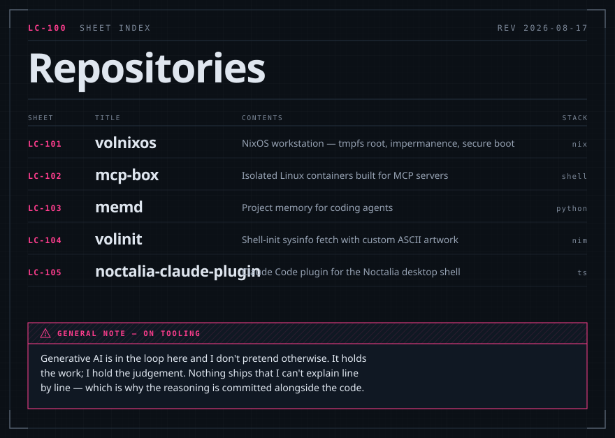
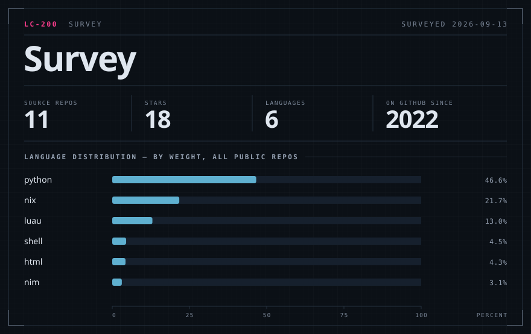
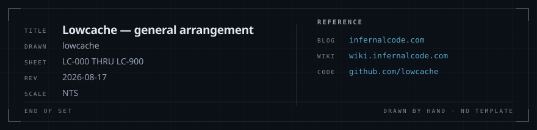

<!--
  github.com/lowcache — sheet set LC-000 … LC-900.

  Every image here is build output. Do not hand-edit assets/*.svg; edit
  scripts/build_sheets.py and run `make sheets`. See scripts/drawset.py.

  Each sheet ships in two editions. The wide one is authored at 880px; the
  narrow one at 460px with its own single-column layout and larger type, because
  scaling the wide sheet down to a phone takes its 9.5px sheet labels below 4px
  -- present but unreadable. <source media> switches between them, which was
  checked against GitHub's markdown pipeline: the sanitizer keeps width-based
  media queries, not just the well-known prefers-color-scheme one.

  No markdown headings on purpose: the sheets carry their own typography, and
  GitHub's h1/h2 styling would cut across it. No external images or badges
  either, so nothing here can break when someone else's service goes down.
-->

<picture>
  <source media="(max-width: 800px)" srcset="assets/sheet-lc000-narrow.svg">
  
</picture>

<picture>
  <source media="(max-width: 800px)" srcset="assets/sheet-lc100-narrow.svg">
  
</picture>

  <a href="https://github.com/lowcache/volnixos">volnixos</a> ·
  <a href="https://github.com/lowcache/mcp-box">mcp-box</a> ·
  <a href="https://github.com/lowcache/memd">memd</a> ·
  <a href="https://github.com/lowcache/volinit">volinit</a> ·
  <a href="https://github.com/lowcache/noctalia-claude-plugin">noctalia-claude-plugin</a>

<picture>
  <source media="(max-width: 800px)" srcset="assets/sheet-lc200-narrow.svg">
  
</picture>

<picture>
  <source media="(max-width: 800px)" srcset="assets/sheet-lc900-narrow.svg">
  
</picture>

  <a href="https://infernalcode.com">infernalcode.com</a> ·
  <a href="https://wiki.infernalcode.com">wiki.infernalcode.com</a> ·
  <a href="https://buymeacoffee.com/lowcache">buymeacoffee.com/lowcache</a>

